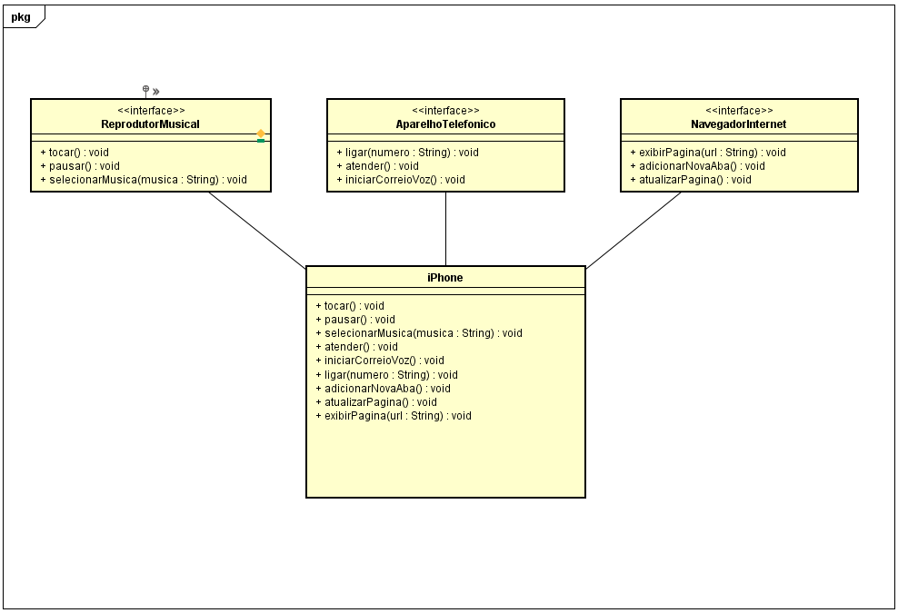

# Projeto iPhone - Implementação de Interfaces em Java

Este projeto foi desenvolvido como um exercício para aprender e implementar interfaces em Java. O exemplo escolhido é a simulação das funcionalidades do iPhone, integrando três interfaces diferentes: `ReprodutorMusical`, `NavegadorInternet`, e `AparelhoTelefonico`.

## Descrição

A classe `IPhone` implementa as seguintes interfaces:

- **ReprodutorMusical**: Responsável pelas funções de tocar, pausar e selecionar músicas.
- **NavegadorInternet**: Simula um navegador de internet com funções para exibir páginas, adicionar novas abas e atualizar páginas.
- **AparelhoTelefonico**: Inclui funcionalidades de um telefone, como fazer e atender ligações e acessar o correio de voz.

## Classe Principal

A classe `IPhone` implementa todos os métodos definidos pelas interfaces mencionadas. Cada método contém uma simples mensagem de impressão para simular a funcionalidade.

### Exemplo de Código

```java
public class IPhone implements ReprodutorMusical, NavegadorInternet, AparelhoTelefonico {
    // Implementações dos métodos das interfaces
}
```

## Diagrama UML
O diagrama UML abaixo ilustra a relação entre a classe IPhone e as interfaces que ela implementa:



## Como Executar
1. Clone o repositório.
2. Compile o código-fonte com um compilador Java.
3. Execute o arquivo IPhone.java para ver as funcionalidades em ação.